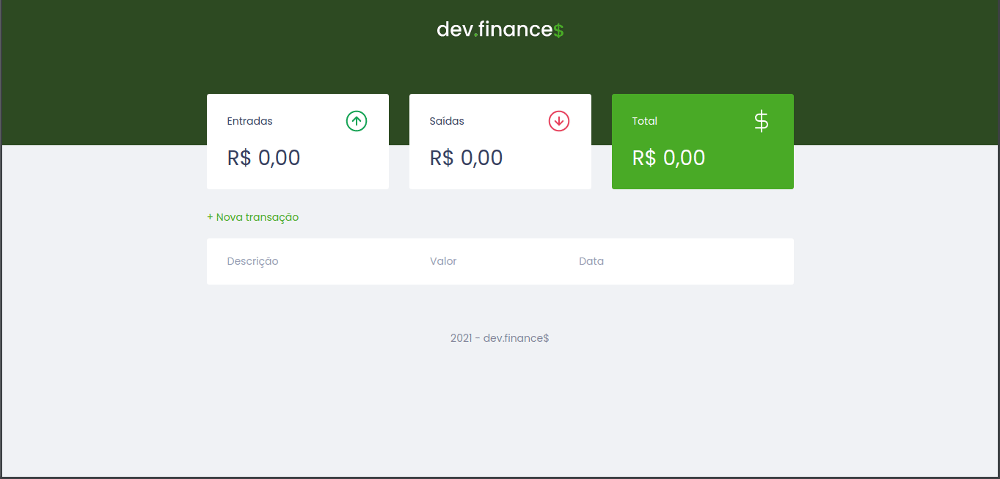

<h1 align="center">
    
</h1>

<h1>

</h1>

## 🗒️ Sobre

Aplicação básica de gerenciamento de finanças criada na Maratona Discover da Rocketseat.

<br>

---

## 🚀 Tecnologias utilizadas

- HTML5
- CSS3
- JavaScript

<br>

---

## 💾 Como baixar/testar o projeto

- Para clonar o repositório você irá precisar instalar o [Git](https://git-scm.com/)
- Clonar o repositório ou fazer o download .zip pelo botão "code" acima


```bash
# Clonar o repositório
$ git clone https://github.com/jeanmontt/dev.finances.git
```
- Caso esteja utilizando Visual Studio Code basta rodar com a extensão Live Server.
- Caso tenha feito o downloads .zip basta acessar a o diretório "src", "views" e abrir o arquivo "index.html" em seu navegador.

<br>

---

#### Desenvolvido por:

***Jean Monteiro*** 
<br/> 
<a href="https://www.linkedin.com/in/jeanmont/">

</a>
